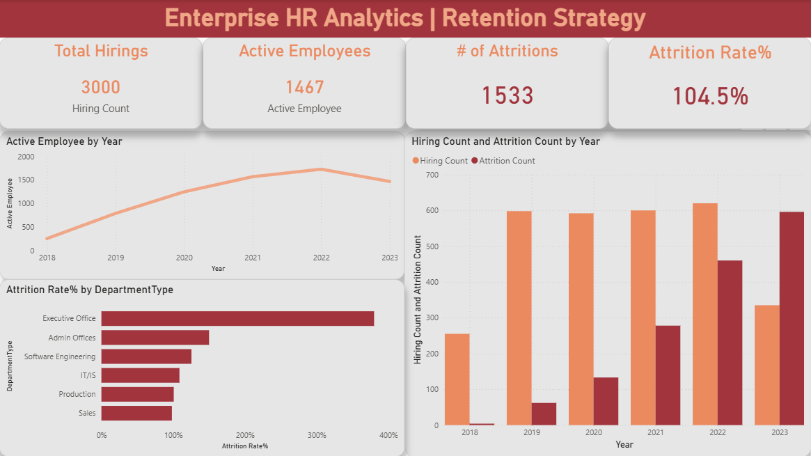
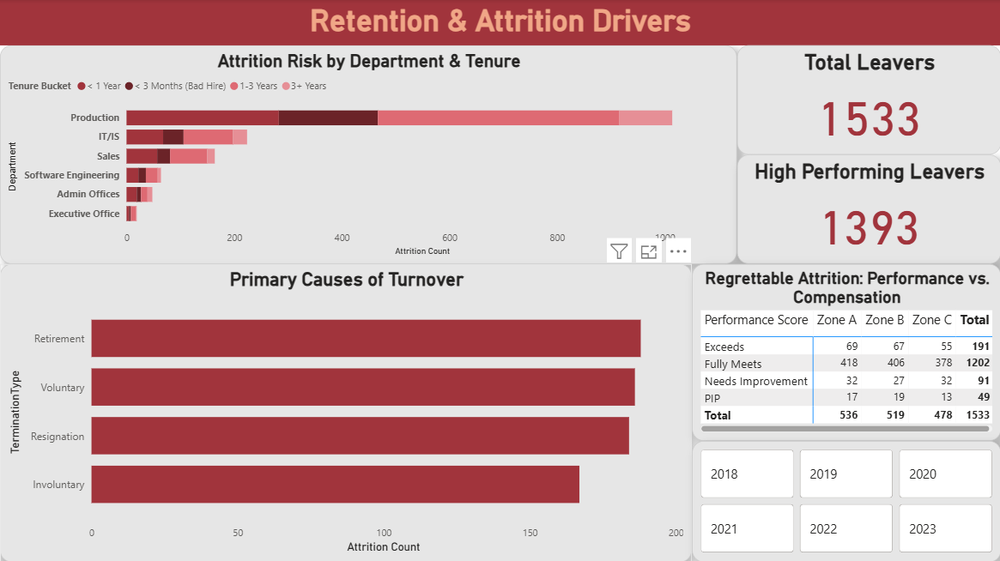
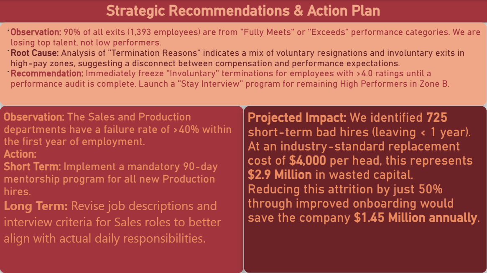

# 📉 Enterprise HR Analytics | Retention Strategy

### 📊 Project Overview
**Goal:** Analyze workforce data to identify the root causes of rising attrition and calculate the financial impact of "Bad Hires."
**Tools:** Power BI, DAX (Time Intelligence), Power Query.

---

### 🖼️ Executive Dashboard

**Page 1: Workforce Overview**

*Tracks active headcount trends and hiring vs. attrition flow over time.*

**Page 2: Retention Diagnostics (The "Why")**

*Identifies the "Short Term" turnover crisis in Sales/Production and the "High Performer" retention gap.*

**Page 3: Strategic Action Plan**

*Executive summary quantifying the $2.9M financial loss and proposing specific interventions.*

---

### 🔎 Key Findings & Financial Impact

#### 1. The $2.9 Million "Bad Hire" Problem
* **Observation:** The Production and Sales departments have a critically high failure rate. **725 employees** left the company within less than 1 year of joining.
* **Financial Impact:** At an industry-standard replacement cost of $4,000 per head, this short-term turnover represents **$2,900,000 in wasted capital**.
* **Recommendation:** Implement a mandatory 90-day mentorship program to cut this rate by 50%, potentially saving **$1.45M annually**.

#### 2. The "High Performer" Exodus
* **Observation:** **90%** of all employees who left (1,393 individuals) were rated as "Fully Meets" or "Exceeds" performance.
* **Implication:** The company is failing to retain its top talent while retaining low performers.
* **Action:** Immediate compensation audit for Pay Zone A employees with "Exceeds" ratings.

---

### 🛠️ Technical Implementation
* **Time Intelligence:** Built a `Date Table` and used `USERELATIONSHIP` to calculate "Attrition Count" based on Exit Date vs. Start Date.
* **Advanced DAX:**
    * **Tenure Buckets:** `SWITCH(TRUE(), [Days] <= 90, "<3 Months", ...)` to cohort employees.
    * **Headcount:** `CALCULATE(COUNTROWS, REMOVEFILTERS(Date))` to calculate historical staff levels accurately.
